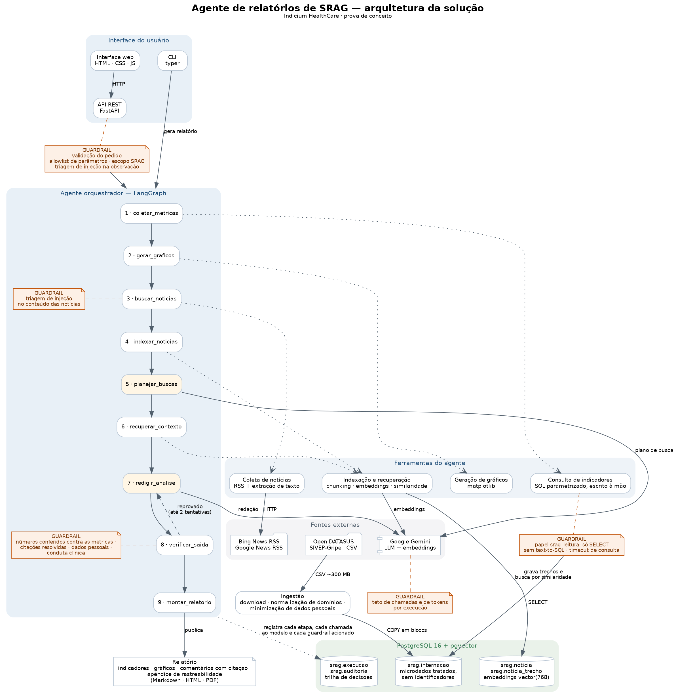

# Relatórios automatizados de SRAG

[](https://github.com/davidcouto-ai/ai_news/actions/workflows/testes.yml)

Prova de conceito de um agente que gera relatórios de situação sobre Síndrome Respiratória
Aguda Grave. Ele consulta os microdados do SIVEP-Gripe publicados no Open DATASUS, calcula
quatro indicadores, desenha os gráficos de evolução e busca notícias recentes para explicar o
que os números estão mostrando.

A regra que organiza todo o projeto é simples: **o modelo de linguagem não produz números**.
Os indicadores saem de consultas SQL escritas à mão; o modelo recebe o resultado pronto e
escreve a análise, que depois passa por uma verificação automática antes de virar relatório.

<p align="center">
  
</p>

O diagrama conceitual também está em [`docs/arquitetura.pdf`](docs/arquitetura.pdf).

**Um relatório de verdade, gerado pela solução, está em [`reports/exemplo/`](reports/exemplo/)**
— [PDF](reports/exemplo/relatorio.pdf), [Markdown](reports/exemplo/relatorio.md) e a
[trilha de auditoria completa](reports/exemplo/auditoria.json) daquela execução. Dá para ver a
solução sem precisar rodar nada.

---

## Como rodar

**Pré-requisito:** Docker e Docker Compose. Nada mais — Python, Postgres, Graphviz e as
bibliotecas de PDF ficam todos dentro da imagem.

```bash
docker compose up -d --build                                    # sobe banco e API
docker compose exec -T api python -m srag.cli schema            # cria o schema
docker compose exec -T api python -m srag.cli ingestao --ano 2026   # carrega um ano (~300 MB)
```

Pronto: `http://localhost:8080`.

Há um `Makefile` com atalhos para os mesmos comandos (`make up`, `make ingest ANO=2026`), mas
ele é conveniência, não requisito. **No PowerShell e no Prompt de Comando do Windows o `make`
não existe** — use os comandos `docker compose` acima, que funcionam em qualquer terminal, ou
rode o `make` a partir do WSL ou do Git Bash.

### Carregando vários anos

O comando aceita `--ano` repetido e carrega um arquivo de cada vez:

```bash
docker compose exec -T api python -m srag.cli ingestao --ano 2024 --ano 2025 --ano 2026
```

Pelo Makefile, `make ingest ANOS="2024 2025 2026"`.

Os anos vão de 2019 a 2026 e podem ser carregados em qualquer ordem ou em execuções separadas:
a tabela acumula e deduplica pela chave da notificação, então repetir um ano já carregado não
duplica nada. Cada arquivo tem de 200 a 400 MB, e 2021 sozinho tem 1,7 milhão de linhas — o
ano de pico da covid.

O relatório de exemplo foi gerado sobre **2021 a 2026**, 3.402.357 internações, o que inclui o
conjunto "SRAG 2021 a 2024" citado no enunciado do desafio. Para só experimentar, um ano basta:
a janela de análise é ancorada na data mais recente da base, seja ela qual for.

### A chave do Gemini

Sem chave o sistema roda assim mesmo: o relatório sai com os indicadores, os gráficos e o
apêndice de rastreabilidade, e só a análise textual é omitida. Para ter a parte escrita, crie
um `.env` na raiz com **uma linha**:

```
GOOGLE_API_KEY=sua-chave-aqui
```

e recrie o container da API (`docker compose up -d api`). O endpoint `/health` diz em que modo
o serviço está.

Resista à tentação de fixar nome de modelo no `.env`. O Google aposenta modelo sem aviso, e um
nome fixo ali vence o default do código — que é atualizado junto com o projeto. As demais
variáveis, todas opcionais, estão em [`docs/configuracao.md`](docs/configuracao.md).

### Comandos disponíveis

| Comando | Equivalente sem `make` |
| --- | --- |
| `make up` | `docker compose up -d --build` + `... cli schema` |
| `make down` | `docker compose down` |
| `make ingest ANOS="2025 2026"` | `... cli ingestao --ano 2025 --ano 2026` |
| `make relatorio UF=SP` | `... cli relatorio --uf SP` |
| `make test` | `docker compose exec -T api pytest -q` |
| `make lint` | `docker compose exec -T api ruff check src tests` |
| `make diagrama` | `... cli diagrama` |
| `make logs` | `docker compose logs -f api` |

Onde `...` é `docker compose exec -T api python -m srag.cli`.

### Interfaces

- **Interface web** em `http://localhost:8080`: formulário, acompanhamento da execução nó a
  nó, relatório renderizado, painel de guardrails e trilha de auditoria.
- **API REST** com documentação automática em `http://localhost:8080/docs`.
- **CLI**: `docker compose exec api python -m srag.cli --help`.

| Rota | Para quê |
| --- | --- |
| `POST /api/relatorios` | dispara a geração e devolve o `run_id` |
| `GET /api/relatorios/{run_id}` | situação, etapas concluídas e relatório em HTML |
| `GET /api/relatorios/{run_id}/pdf` | download do PDF |
| `GET /api/execucoes/{run_id}/auditoria` | trilha completa da execução |
| `GET /api/metricas` | indicadores puros, sem passar pelo modelo |
| `GET /health` | situação do banco, do modelo e do volume de dados |

---

## Como funciona

O orquestrador é um grafo em LangGraph com nove nós:

```
1 coletar_metricas   →  SQL parametrizado, conexão somente leitura
2 gerar_graficos     →  matplotlib, dois PNGs
3 buscar_noticias    →  Bing News RSS + Google News RSS, extração de texto
4 indexar_noticias   →  chunking, embeddings e gravação no pgvector
5 planejar_buscas    →  o modelo decide o que procurar para cada indicador
6 recuperar_contexto →  busca por similaridade, uma consulta por indicador
7 redigir_analise    →  o modelo escreve, com saída estruturada
8 verificar_saida    →  reprovou? volta para o 7 (até 2 vezes)
9 montar_relatorio   →  Markdown → HTML → PDF
```

A ordem é fixa e o único desvio de fluxo é o retorno da verificação para a redação. O modelo
toma uma decisão de verdade — as perguntas de recuperação do nó 5 — e escreve o texto do nó 7.
Todo o resto é determinístico.

Essa escolha é deliberada e está justificada em [`docs/decisoes.md`](docs/decisoes.md): em
vigilância epidemiológica, reprodutibilidade vale mais do que autonomia. Com consultas fixas, o
SQL de cada número vai impresso no apêndice do relatório e qualquer pessoa reproduz o valor
sem precisar do agente.

---

## Os indicadores

| Indicador | Numerador ÷ denominador |
| --- | --- |
| Taxa de aumento de casos | casos dos últimos *N* dias ÷ casos dos *N* dias anteriores |
| Taxa de mortalidade | óbitos por SRAG ÷ casos já encerrados |
| Taxa de ocupação de UTI | internações que passaram pela UTI ÷ internações com o campo preenchido |
| Taxa de vacinação | casos que declararam vacinação ÷ casos com o campo preenchido |

Mais dois gráficos: casos diários dos últimos 30 dias (com média móvel de 7 dias) e casos
mensais dos últimos 12 meses.

Duas ressalvas metodológicas que aparecem no próprio relatório, porque mudam a leitura dos
números:

- **A taxa de ocupação de UTI não é ocupação de leitos.** O SIVEP-Gripe não informa leitos
  disponíveis. O que se mede é a proporção de internações por SRAG que passaram pela UTI —
  indicador de gravidade, não de capacidade instalada. Como aproximação de pressão
  assistencial, o relatório traz também a permanência média em UTI.
- **A taxa de vacinação é entre os casos notificados, não da população.** A base só enxerga
  quem adoeceu o suficiente para ser notificado. Ela responde "qual o perfil vacinal de quem
  está internando", não "quantos brasileiros estão vacinados". Vale a pena detalhar esse ponto,
  logo abaixo.

Uma terceira decisão que merece destaque: a janela de análise **não termina no último dia da
base**. O SIVEP é preenchido com atraso, e os dias mais recentes aparecem sempre incompletos.
Se a janela fosse até o último registro, esse atraso seria lido como queda de casos. Por isso a
data de referência padrão é `max(data de sintomas) − 5 dias`, e o relatório declara isso.

### Sobre "taxa de vacinação da população"

O indicador pedido é a taxa de vacinação **da população**. Os microdados do SIVEP-Gripe não
têm essa informação: o campo `VACINA_COV` é autodeclarado por caso notificado, e o denominador
disponível são internações, não habitantes. Não dá para derivar cobertura populacional de uma
base que só registra quem adoeceu.

Fui atrás da fonte que teria o dado. A cobertura oficial vem do SI-PNI, publicada no conjunto
[Campanha Nacional de Vacinação contra Covid-19](https://opendatasus.saude.gov.br/dataset/covid-19-vacinacao),
que é microdado por dose aplicada — dezenas de gigabytes, quebrados por UF — e cuja API exige
credencial. Ingerir isso numa PoC seria desproporcional, e amarraria quem for avaliar o projeto
a uma credencial que ele não tem.

O que fiz, então:

1. **Calculo e reporto o que a base sustenta**: a proporção de casos graves de SRAG que
   declararam vacinação, com quebra por faixa etária. É um indicador legítimo e, para o caso de
   uso do desafio — entender severidade e avanço do surto —, arguivelmente mais informativo que
   a cobertura populacional: o contraste entre 1,5% de vacinados na faixa de menores de 1 ano e
   90,3% acima de 80 anos diz algo direto sobre quem está internando.
2. **Declaro a diferença no próprio relatório**, na linha "Como ler" da métrica, para que
   ninguém leia o número como cobertura nacional.
3. **Deixo o ponto de extensão preparado**: `data/referencia/` existe para receber uma tabela de
   cobertura oficial por UF, com citação de fonte, se a PoC virar produto.

Preferi entregar um número correto com o rótulo certo a entregar um número com o rótulo que o
enunciado pediu mas que os dados não sustentam.

Definições completas em [`docs/dicionario_metricas.md`](docs/dicionario_metricas.md).

---

## Governança e auditoria

Cada execução recebe um `run_id` e grava uma trilha em duas vias: a tabela `srag.auditoria`
(que a API expõe) e `logs/execucoes.jsonl` (que sobrevive à recriação do banco e qualquer
coletor de log ingere). Cada linha registra etapa, ação, parâmetros, resumo do resultado,
duração, modelo, tokens consumidos e mensagem de erro, se houver.

O que fica rastreável na prática:

- o SQL exato e os parâmetros de cada indicador — impressos no apêndice de todo relatório;
- quais matérias foram coletadas, quais foram recusadas na triagem e por quê;
- qual trecho de qual matéria entrou no contexto de qual indicador, com a distância de
  similaridade;
- cada chamada ao modelo, com contagem de tokens e a versão do prompt usada;
- cada guardrail acionado, inclusive os que **aprovaram** — registrar só o bloqueio não
  permite dizer depois que a verificação rodou.

O objetivo: qualquer número do relatório é rastreável até a consulta que o produziu, e
qualquer afirmação qualitativa até a matéria que a sustenta.

---

## Guardrails

| Camada | O que faz |
| --- | --- |
| Validação do pedido | a interface aceita parâmetros, não pergunta livre; UF, janela, classificação e data passam por allowlist. O único campo de texto (observação) tem limite de tamanho, precisa estar no escopo de SRAG e passa pela triagem de injeção |
| Acesso ao banco | papel `srag_leitura` só tem `SELECT`, transação em modo somente leitura e `statement_timeout`. Não existe text-to-SQL em lugar nenhum |
| Injeção via notícia | detector heurístico descarta matérias com padrão de instrução ("ignore as instruções anteriores", marcações de papel, comandos SQL); o que passa entra no prompt dentro de bloco delimitado, com o system prompt declarando que aquilo é dado, não ordem |
| Verificação da saída | todo percentual e toda contagem acima de mil citados no texto são conferidos contra os valores calculados; toda citação `[n]` precisa resolver para uma matéria recuperada; o texto é varrido por padrões de CPF, cartão do SUS, telefone e e-mail, e por linguagem de conduta clínica individual |
| Orçamento | teto de chamadas e de tokens por execução, com o estouro registrado e interrompendo o fluxo |

### O guardrail funcionando

A execução que está em `reports/exemplo/` não foi escolhida a dedo. Na primeira tentativa o
modelo pegou um percentual de uma matéria e apresentou como se fosse métrica calculada. A
verificação recusou o texto, o agente reescreveu com o motivo em mãos e a segunda versão
passou. Está tudo na trilha:

```
 9  llm        redigir_tentativa_1    ok          10.663ms   8.068 tokens
10  guardrail  verificacao_de_saida   bloqueado   "o percentual 2.4% não corresponde
                                                   a nenhuma métrica calculada"
11  llm        redigir_tentativa_2    ok          10.417ms   8.367 tokens
12  guardrail  verificacao_de_saida   ok          "16 números conferidos, nenhum problema"
```

Isso aconteceu nas duas execuções que rodei para gerar o exemplo, com números diferentes —
não é um caso raro que eu tenha caçado. É o comportamento esperado de um modelo que recebe
manchetes cheias de percentuais no contexto, e é exatamente por isso que a verificação existe.

Reprovou na verificação? O agente reescreve com o motivo em mãos, no máximo duas vezes.
Persistindo, o relatório sai **sem a análise textual** e com a ressalva explícita — os
indicadores e os gráficos continuam válidos, porque não dependem do modelo. Relatório com um
buraco declarado é melhor do que relatório com número que ninguém consegue rastrear.

Vale ser honesto sobre o limite: detecção heurística de injeção é porosa, e prompt bem
construído passa. A defesa que de fato segura o estrago é arquitetural — o agente não tem
ferramenta de escrita, o banco não aceita nada além de `SELECT` e os números vêm conferidos.

---

## Dados sensíveis

A base do Open DATASUS já é publicada anonimizada, mas ainda traz quase-identificadores
suficientes para reidentificação em recortes pequenos. O tratamento aqui é em três camadas:

**1. Minimização na entrada.** A leitura do CSV seleciona ~27 das quase 200 colunas. Ficam de
fora todos os campos de texto livre da ficha (`MORB_DESC`, `OUTRO_DES`, `DS_IF_OUT`) e os
identificadores indiretos finos (data de nascimento, município de residência). A idade é
generalizada em faixa etária e a geografia truncada em UF **antes** do `COPY`. O número da
notificação nem chega a ser gravado: vira um hash, usado só para deduplicar recargas. Uma
verificação em `anonimizacao.py` derruba a carga se alguma coluna identificadora escapar.

**2. Isolamento do modelo.** Nenhum registro individual chega ao Gemini. As ferramentas
devolvem exclusivamente agregados, e quebras com menos de 5 registros são suprimidas.

**3. Higiene da trilha.** A auditoria guarda parâmetros, contagens e hashes — nunca linhas de
dados. O guardrail de saída ainda varre o texto final atrás de padrões de dado pessoal.

Sobre a LGPD: são dados públicos de vigilância em saúde, tratados para finalidade de saúde
pública. As camadas acima não substituem a anonimização da origem — são defesa em
profundidade, para o caso de a base mudar ou de um bug meu vazar o que não deveria.

---

## Estrutura

```
src/srag/
  config.py          configuração por variável de ambiente
  db/                engine, schema.sql, papel somente leitura
  ingestao/          download, normalização de domínios, anonimização, carga
  metricas/          consultas SQL, cálculo dos indicadores e das séries
  graficos.py        os dois gráficos do relatório
  noticias/          fontes RSS, extração de texto, índice vetorial
  agente/            grafo LangGraph, prompts, ferramentas, cliente do LLM
  guardrails/        validação do pedido, triagem de injeção, verificação da saída
  auditoria.py       trilha de execução
  relatorio/         montagem em Markdown e conversão para HTML/PDF
  api/               FastAPI e interface web
  cli.py
tests/               71 testes
docs/                diagrama, decisões de arquitetura, dicionário de métricas, configuração
```

## Testes

```bash
make test
```

A suíte cobre a normalização do CSV (data impossível, código fora do dicionário, campo vazio,
saída de UTI antes da entrada), o cálculo de cada indicador com valores conferidos na mão, a
supressão por k-anonimato, os guardrails de entrada e de saída, o fluxo de reescrita do grafo
com um modelo falso e o contrato da API.

Os testes de métrica rodam contra um Postgres de verdade, num banco descartável criado na hora.
Metade do que essas consultas fazem é comportamento do próprio Postgres — `count(*) FILTER`,
`date_trunc`, o cast dos parâmetros nulos —, então testar contra mock não provaria nada.

A mesma suíte roda no GitHub Actions a cada push e a cada pull request, contra um serviço
`pgvector/pgvector:pg16` ([`.github/workflows/testes.yml`](.github/workflows/testes.yml)).
Nenhum teste depende de rede ou de chave de API: a coleta de notícias é substituída por um
dossiê fixo e o modelo, por um dublê. Se a suíte ficar vermelha, é código, não ambiente.

---

## Limitações conhecidas

- **Desconto fixo de atraso de notificação.** Cinco dias para o país inteiro é aproximação
  grosseira: o atraso varia bastante entre UFs. O correto seria estimar a curva de atraso e
  fazer *nowcasting*, como o InfoGripe faz.
- **Nem toda matéria entra com texto integral.** O Google News só entrega link de
  redirecionamento, e o endereço original depende de um endpoint interno não documentado que
  optei por não usar. Essas matérias entram com título, veículo e data; o relatório cita pelo
  que de fato foi lido.
- **A taxa de vacinação não é populacional.** Precisaria de uma segunda fonte, e a base de
  campanha de vacinação do Ministério da Saúde é grande demais para uma PoC. O diretório
  `data/referencia/` está reservado para isso.
- **Mortalidade com censura à direita.** Casos recentes ainda não têm desfecho, o que
  subestima a taxa nos últimos dias. O relatório informa quantos casos estão em aberto para
  dimensionar o efeito, mas não corrige o viés.
- **A verificação de citação é sintática, não semântica.** O guardrail confere que todo `[n]`
  resolve para uma matéria efetivamente recuperada — não que aquela matéria sustente a frase.
  Numa execução real o modelo escreveu "o impacto da mortalidade concentra-se na população
  idosa [2, 4]" citando duas matérias que falavam de rinovírus no Acre e de alerta no Mato
  Grosso do Sul. A afirmação é epidemiologicamente correta, mas a fonte citada não era a fonte
  dela. Fechar isso exigiria um segundo modelo julgando implicação entre a frase e o trecho
  recuperado, o que custa uma chamada por afirmação e traz o problema de usar um LLM para
  auditar outro. Achei honesto declarar em vez de deixar passar como se estivesse coberto.
- **Execução em memória.** A API dispara a geração em background task do próprio processo. Em
  produção isso seria uma fila (Celery, RQ) com retentativa e isolamento.
- **Sem autenticação.** É uma PoC local. Antes de expor qualquer coisa, precisaria de
  autenticação, controle de acesso por perfil e limite de taxa.

## Fontes

- Microdados: [SRAG 2019 a 2026 — Open DATASUS](https://dadosabertos.saude.gov.br/dataset/srag-2019-a-2026)
- Dicionário de variáveis do SIVEP-Gripe, publicado no mesmo conjunto de dados
- Notícias: Bing News RSS e Google News RSS, ambos feeds públicos
- Modelo: Google Gemini (LLM e embeddings)
