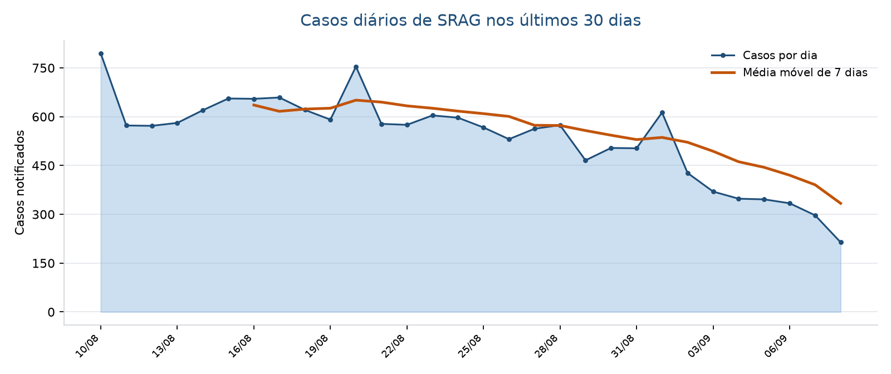
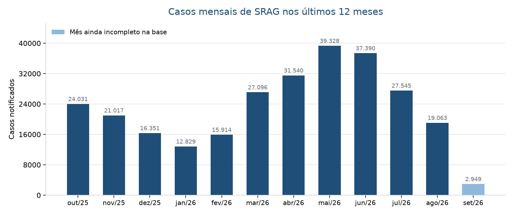

# Relatório de situação — Síndrome Respiratória Aguda Grave

- **Recorte:** Brasil
- **Data de referência:** 08/09/2026
- **Janela de análise:** 10/08/2026 a 08/09/2026 (30 dias)
- **Registros na base:** 548.669 internações notificadas
- **Emitido em:** 16/09/2026 às 03:01
- **Identificador da execução:** `c478c1f88f6440c1`

> Relatório gerado automaticamente a partir dos microdados públicos do SIVEP-Gripe (Open DATASUS) e de notícias coletadas na data de emissão. Destina-se a apoiar a leitura do cenário epidemiológico coletivo e **não** substitui avaliação clínica, boletim oficial ou decisão assistencial individual.

## Panorama

O cenário epidemiológico nacional indica uma desaceleração na transmissão de SRAG, com taxa de aumento de casos de -27,9% no comparativo dos últimos 30 dias. Essa retração no agregado do país é acompanhada pela queda das internações associadas a vírus sincicial respiratório e influenza [1, 5]. Por outro lado, persistem registros de aumento de infecções em faixas pediátricas e escolares impulsionadas pela circulação de rinovírus [2, 3]. Diante desse comportamento heterogêneo entre idades e regiões, certas capitais mantêm níveis de alerta e atenção assistencial [4].

## Indicadores

### Taxa de aumento de casos: -27,9%

| Numerador | Denominador | Sem informação | Período |
| --- | --- | --- | --- |
| 16.087 | 22.314 | 0 | 10/08/2026 a 08/09/2026 |

A taxa de aumento de casos foi de -27,9%, correspondendo a 16.087 casos nos últimos 30 dias frente a 22.314 no intervalo anterior. O dado expressa redução do ritmo de novas hospitalizações, tendo sua janela encerrada cinco dias antes do encerramento da série para mitigar o efeito de atrasos de notificação. Esse declínio geral reflete a perda de força do VSR e da influenza, ainda que haja manutenção de alta em crianças e adolescentes decorrente de rinovírus [1, 3].

*Como ler:* Compara os últimos 30 dias com os 30 dias imediatamente anteriores, por data de início de sintomas. A janela termina 5 dias antes do último registro da base para não confundir atraso de notificação com queda de casos.

### Taxa de mortalidade: 5,3%

| Numerador | Denominador | Sem informação | Período |
| --- | --- | --- | --- |
| 429 | 8.126 | 7.961 | 10/08/2026 a 08/09/2026 |

| Recorte | Valor | Base |
| --- | --- | --- |
| Óbitos por SRAG | 5,3 | 8.126 |
| Óbitos por outras causas | 2,6 | 8.126 |

A taxa de mortalidade observada foi de 5,3%, com 429 óbitos por SRAG entre 8.126 casos com desfecho já concluído. É fundamental destacar que 7.961 casos da janela permanecem sem encerramento registrado, o que exclui essas fichas do cálculo e tende a subestimar a letalidade recente. Boletins epidemiológicos apontam que, enquanto as hospitalizações afetam intensamente a infância, o impacto dos óbitos por SRAG recai primordialmente sobre a população com idade avançada [3, 6].

*Como ler:* Óbitos por SRAG sobre os casos já encerrados no período. 7.961 casos da janela ainda estão sem desfecho registrado e ficam fora do denominador, o que tende a subestimar a taxa nos dias mais recentes.

### Taxa de ocupação de UTI: 28,3%

| Numerador | Denominador | Sem informação | Período |
| --- | --- | --- | --- |
| 3.973 | 14.047 | 2.040 | 10/08/2026 a 08/09/2026 |

| Recorte | Valor | Base |
| --- | --- | --- |
| Permanência média em UTI (dias) | 4,7 | 3.973 |

A taxa de ocupação de UTI atingiu 28,3%, com 3.973 admissões em cuidados intensivos entre 14.047 registros válidos e tempo médio de permanência de 4,7 dias. O indicador deve ser lido estritamente como medida de severidade clínica dos pacientes, visto que a base do SIVEP-Gripe não contabiliza a capacidade instalada de leitos na rede. Esse nível de demanda crítica exige monitoramento constante da rede hospitalar, especialmente em centros urbanos classificados em faixas de alerta ou risco [4].

*Como ler:* O SIVEP-Gripe não informa leitos disponíveis, então isto não é ocupação de leitos: é a proporção de internações por SRAG que passaram pela UTI, entre as fichas com o campo preenchido. Serve como indicador de gravidade, não de capacidade instalada.

### Taxa de vacinação contra covid-19: 39,2%

| Numerador | Denominador | Sem informação | Período |
| --- | --- | --- | --- |
| 6.223 | 15.895 | 192 | 10/08/2026 a 08/09/2026 |

| Recorte | Valor | Base |
| --- | --- | --- |
| < 1 ano | 1,5 | 4.325 |
| 1 a 4 anos | 10,7 | 3.843 |
| 5 a 11 anos | 38,1 | 2.034 |
| 12 a 17 anos | 62,4 | 340 |
| 18 a 29 anos | 83,5 | 376 |
| 30 a 39 anos | 87,2 | 376 |
| 40 a 49 anos | 85,5 | 447 |
| 50 a 59 anos | 85,8 | 578 |
| 60 a 69 anos | 89,0 | 985 |
| 70 a 79 anos | 92,1 | 1.195 |
| 80 anos ou mais | 90,3 | 1.396 |

A taxa de vacinação contra covid-19 entre os casos notificados foi de 39,2%, correspondendo a 6.223 imunizados dentre 15.895 fichas preenchidas. O indicador reflete exclusivamente o histórico de vacinação de indivíduos com quadro de infecção grave notificada, não devendo ser confundido com a cobertura vacinal da população em geral. O perfil revela baixa adesão entre os mais jovens, registrando 1,5 no estrato < 1 ano e 10,7 na faixa de 1 a 4 anos, contrastando com 90,3 no grupo de 80 anos ou mais [6].

*Como ler:* É a cobertura vacinal declarada entre os casos notificados de SRAG, não a cobertura da população geral: a base só enxerga quem adoeceu o suficiente para ser notificado. Serve para comparar o perfil vacinal dos casos graves, não para medir a campanha.

## Evolução dos casos



*Casos diários de SRAG nos últimos 30 dias.*



*Casos mensais de SRAG nos últimos 12 meses.*

## Sinais de alerta

- Volume elevado de casos sem desfecho: a presença de 7.961 registros pendentes de encerramento na janela atual pode subestimar a taxa de mortalidade de 5,3%.
- Disparidade na vacinação dos casos graves pediátricos: índices de 1,5 em menores de < 1 ano e de 10,7 entre 1 a 4 anos contrastam com o padrão de hospitalizações na infância [6].
- Atividade de SRAG persistente na faixa pediátrica: aumento contínuo de casos infantis relacionados ao rinovírus em cenários com capitais em nível de risco assistencial [3, 4].

## Fontes consultadas

[1] Cinco estados estão em alerta para síndrome respiratória aguda grave - agenciabrasil.ebc.com.br, 11/09/2026. https://agenciabrasil.ebc.com.br/radioagencia-nacional/saude/audio/2026-09/cinco-estados-estao-em-alerta-para-sindrome-respiratoria-aguda-grave
[2] Casos de síndrome respiratória grave caem 45% no Pará nas últimas semanas, aponta Sespa - oliberal.com, 15/09/2026. https://www.oliberal.com/para/casos-de-sindrome-respiratoria-grave-caem-45-no-para-nas-ultimas-semanas-aponta-sespa-1.1169233
[3] Acre registra alta de casos de síndrome respiratória grave associados ao rinovírus, aponta Fiocruz - agazetadoacre.com, 12/09/2026. https://agazetadoacre.com/2026/09/noticias/geral/acre-registra-alta-de-casos-de-sindrome-respiratoria-grave-associados-ao-rinovirus-aponta-fiocruz/
[4] Vitória está entre capitais em alerta para casos de Síndrome Respiratória Aguda Grave - eshoje.com.br, 03/09/2026. https://eshoje.com.br/saude/2026/09/vitoria-capitais-alerta-sra/
[5] InfoGripe: casos de SRAG seguem em queda no país - Brasil 61, 22/08/2026. https://news.google.com/rss/articles/CBMiigFBVV95cUxPS2oxXy1lSWMtQUhvMXctZFRnVlRONWNXRlNnZjN6eXNjbjR1ZE5KZ21vbG9CWDJZWnZwa3Joejd0dEdkcnhtZkc4OWVxV25iWTc0elI4bmZBeWx5UlM3Q201NW0xRW9aZHpvOWNBZXh3R2VWU09CaU04dG12RldWczJHOEJfejRyUXfSAY8BQVVfeXFMUG01STVpRGxGaC1qY0o3cHNpa092X2x3V3FseUxVeWpjcHYxWEVNRndhZ3ZZakk4c20zZ2hXMnFvZHpuSzk5cW9qbDBGOTFMTDRrTTc4LVN6Y3lrTWZrQW5rSGkxeHZHeGVJMjdCM0FLaG85VjJoRl9GN2JMTVkxQXA1RGtBdURhakMzaVJfaVU?oc=5
[6] Casos graves de síndrome respiratória aumentam entre crianças de 2 a 4 anos em MT - gcnoticias.com.br, 01/09/2026. https://www.gcnoticias.com.br/saude/casos-graves-de-sindrome-respiratoria-aumentam-entre-criancas-de-2-a-4-anos-em-mt/262475312

## Apêndice: rastreabilidade

- Identificador da execução: `c478c1f88f6440c1`
- Recorte consultado: UF: Brasil | janela: 30 dias
- Registros considerados: 548.669
- Busca de notícias: SRAG / sindrome respiratoria aguda grave / InfoGripe (Brasil)
- Artigos citados: 6 | descartados na triagem de injeção: 0

Consultas SQL que produziram cada indicador:

**Taxa de aumento de casos** — parâmetros: `{'uf': None, 'classificacao': None, 'fim': '2026-09-08', 'corte': '2026-08-09', 'inicio_anterior': '2026-07-11'}`

```sql
SELECT
    count(*) FILTER (WHERE dt_sintomas > :corte)  AS periodo_atual,
    count(*) FILTER (WHERE dt_sintomas <= :corte) AS periodo_anterior
FROM srag.internacao
WHERE dt_sintomas BETWEEN :inicio_anterior AND :fim
  
    AND (CAST(:uf AS text) IS NULL OR uf_notificacao = CAST(:uf AS text))
    AND (CAST(:classificacao AS text) IS NULL
         OR classificacao_final = CAST(:classificacao AS text))
```

**Taxa de mortalidade** — parâmetros: `{'uf': None, 'classificacao': None, 'inicio': '2026-08-10', 'fim': '2026-09-08'}`

```sql
SELECT
    count(*) FILTER (WHERE evolucao = 'Óbito') AS obitos_srag,
    count(*) FILTER (WHERE evolucao = 'Óbito por outras causas') AS obitos_outras_causas,
    count(*) FILTER (WHERE evolucao IN ('Cura', 'Óbito', 'Óbito por outras causas'))
        AS com_desfecho,
    count(*) FILTER (WHERE evolucao = 'Ignorado') AS sem_desfecho
FROM srag.internacao
WHERE dt_sintomas BETWEEN :inicio AND :fim
  
    AND (CAST(:uf AS text) IS NULL OR uf_notificacao = CAST(:uf AS text))
    AND (CAST(:classificacao AS text) IS NULL
         OR classificacao_final = CAST(:classificacao AS text))
```

**Taxa de ocupação de UTI** — parâmetros: `{'uf': None, 'classificacao': None, 'inicio': '2026-08-10', 'fim': '2026-09-08'}`

```sql
SELECT
    count(*) FILTER (WHERE uti = 'Sim') AS em_uti,
    count(*) FILTER (WHERE uti IN ('Sim', 'Não')) AS com_informacao,
    count(*) FILTER (WHERE uti = 'Ignorado') AS ignorados,
    avg(dias_uti) FILTER (WHERE uti = 'Sim' AND dias_uti IS NOT NULL) AS media_dias_uti
FROM srag.internacao
WHERE dt_sintomas BETWEEN :inicio AND :fim
  
    AND (CAST(:uf AS text) IS NULL OR uf_notificacao = CAST(:uf AS text))
    AND (CAST(:classificacao AS text) IS NULL
         OR classificacao_final = CAST(:classificacao AS text))
```

**Taxa de vacinação contra covid-19** — parâmetros: `{'uf': None, 'classificacao': None, 'inicio': '2026-08-10', 'fim': '2026-09-08'}`

```sql
SELECT
    count(*) FILTER (WHERE vacina_covid = 'Sim') AS vacinados,
    count(*) FILTER (WHERE vacina_covid IN ('Sim', 'Não')) AS com_informacao,
    count(*) FILTER (WHERE vacina_covid = 'Ignorado') AS ignorados
FROM srag.internacao
WHERE dt_sintomas BETWEEN :inicio AND :fim
  
    AND (CAST(:uf AS text) IS NULL OR uf_notificacao = CAST(:uf AS text))
    AND (CAST(:classificacao AS text) IS NULL
         OR classificacao_final = CAST(:classificacao AS text))
```

A trilha completa da execução (cada etapa, cada chamada ao modelo e cada guardrail acionado) está em `GET /api/execucoes/c478c1f88f6440c1/auditoria`.
